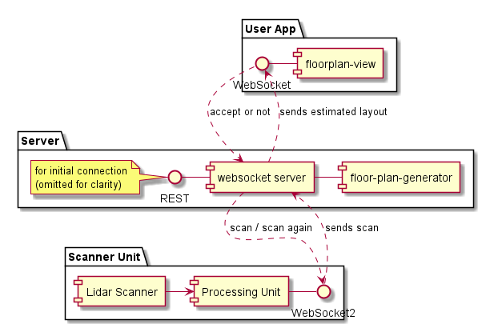
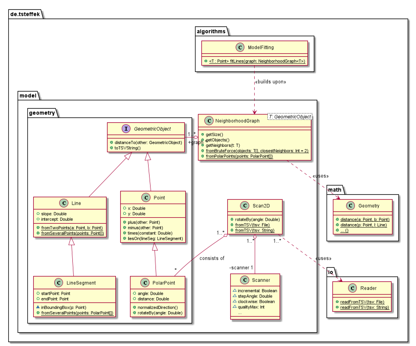
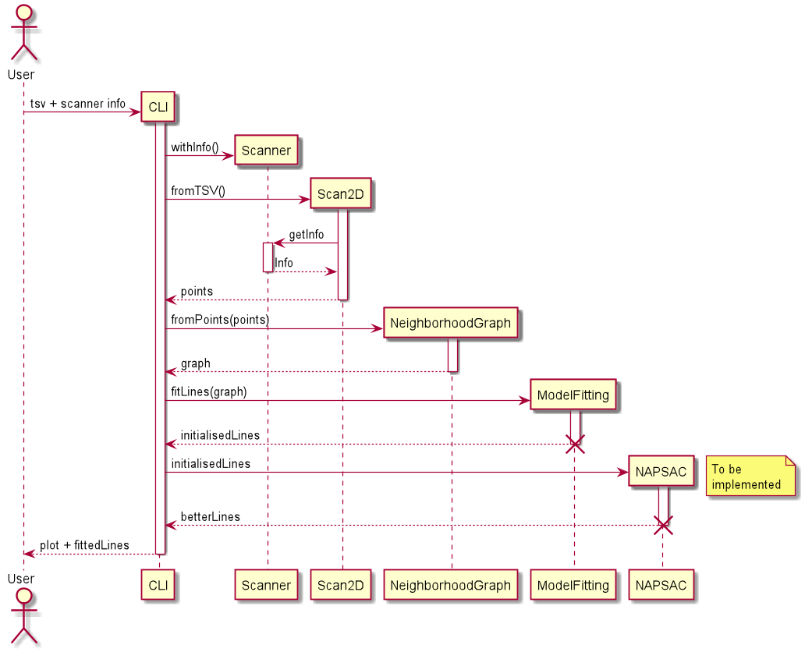

[](https://github.com/tsteffek/floor-plan-generator/actions)
[](https://codecov.io/gh/tsteffek/floor-plan-generator)
[](https://www.codacy.com?utm_source=github.com&amp;utm_medium=referral&amp;utm_content=tsteffek/floor-plan-generator&amp;utm_campaign=Badge_Grade)
[](https://www.codacy.com?utm_source=github.com&amp;utm_medium=referral&amp;utm_content=tsteffek/floor-plan-generator&amp;utm_campaign=Badge_Coverage)
[](https://github.com/semantic-release/semantic-release)

# floor-plan-generator
Backend for a service that turns input of a 2d lidar scan into a floorplan.

View our [docs](docs/index.md)!

## For Professor Edlich

### Table of Content / Quick Checklist

Tasks
 1. [ULM](#1-uml) (<- right there)

 2. [Metrics](#2-metrics) ( badges up top, or here: [Codecov](https://codecov.io/gh/tsteffek/floor-plan-generator),
  [Codacy](https://www.codacy.com?utm_source=github.com&amp;utm_medium=referral&amp;utm_content=tsteffek/floor-plan-generator&amp;utm_campaign=Badge_Coverage))

 3. [Clean Code Development](#3-clean-code-development) (everywhere I hope, good examples include [NeighborhoodGraph.kt](src/main/kotlin/de/tsteffek/model/NeighborhoodGraph.kt), [Geometry.kt](src/main/kotlin/de/tsteffek/math/Geometry.kt))

 4. [Build Management](#4-build-management) (Gradle, see [build.gradle.kts](build.gradle.kts))

 5. [Unit Tests](#5-unit-tests) (where else but in the [test folder](src/test/kotlin/de/tsteffek)?)

 6. [Continuous Delivery](#6-continuous-delivery) ([github action workflows](.github/workflows))

 7. [Use a good IDE](#7-use-a-good-ide) (IntelliJ)

 8. [DSL](#8-dsl) ([my dsl playground](https://github.com/tsteffek/floor-plan-generator/blob/dsl/src/main/kotlin/de/tsteffek/model/Scanner.kt))

 9. [Functional Programming](#9-functional-programming) (nearly everywhere, most notably [Extensions.kt](src/main/kotlin/de/tsteffek/model/Extensions.kt))

Optionals
 1. [Optional 1: Logical Solver in the code](#optional-1-logical-solver-in-the-code) (no idea)

 2. [Optional 2: Write a little code fragment in Scala or Clojure](#optional-2-write-a-little-code-fragment-in-scala-or-clojure) (my [Kafka](https://github.com/tsteffek/Kafka-Scala-Example) and [Spark](https://github.com/tsteffek/Spark-Scala-Example) assignments, hope they count)

 3. [Optional 3: AOP](#optional-3-aop) (`filterAndCount()` in [Extensions.kt](src/main/kotlin/de/tsteffek/model/Extensions.kt) basically imitates that)

## Tasks

### 1. UML

I tried to use IntelliJs auto-generated UMLs, which I didn't get to work. Maybe it doesn't work with Kotlin, maybe it's just not ready yet, maybe I'm holding it wrong. I did use the opportunity to finally work with PlantUML, which, frankly isn't all that bad. Check the [sources](src/docs). That's all all that's needed to generate the following UMLs. Expect for the component diagram, they all immediately aligned well, too.

 1. Component diagram of the target architecture for the whole application (simplified, to explain my brother what's supposed to happen)

    

 2. Class diagram as overview for this module

    

 3. Sequence diagram displaying the target sequence for this module and the current state of this program

    

### 2. Metrics

(see badges at top)

I couldn't use Sonarqube, since that's only free for public repositories, instead I tried these two:
 - **[Codecov](https://codecov.io/gh/tsteffek/floor-plan-generator)**: wouldn't recommend, wouldn't even explain what its complexity score means
 - **[Codacy](https://www.codacy.com?utm_source=github.com&amp;utm_medium=referral&amp;utm_content=tsteffek/floor-plan-generator&amp;utm_campaign=Badge_Coverage)**: would recommend, nice set of features even for private repositories. It tracks coverage and issues. For the issues you select patterns for your specific programming language, which you have to match. These patterns range from linting to good programming practices to performance tips, they basically enforce clean code and then some. The static code analysis tool they use for Kotlin is Detekt, which offers 176 patterns. It will also tell you about so-called "hotspots", 

### 3. Clean Code Development

10 points checklist:
 1. **descriptive / unambiguous names**: be it variables or methods, if you can't tell what it does by its name you should choose a different name (this also means it should tell you WHAT it does, not how, that's what documentation is for)
 2. **short methods**: methods should be short and concise, my personal goal is at most 10 lines. Longer methods tend to violate the next two rules.
 3. **methods should do exactly one thing / side effect free functions**: if you wouldn't expect the behavior from the name of the method it shouldn't be doing it. Logging might be a necessary evil.
 4. **a method should keep the same level of abstraction**: don't mix different levels of abstraction within a method. If one part of it distributes low level computations to other methods, the other part should as well.
 5. **short classes**: classes should be short and concise and do their job, and their job only. Nobody likes monoliths.
 6. **opacity**: code should speak for itself. To cite my co-worker: "If I have to think for more than a minute what a line does, you should change the line." Don't be afraid to add more lines. Reading 10 lines in 3 seconds per line is still faster than taking a minute to figure out that fancy technique you found at stackoverflow.
 7. **comments are usually bad**: !not to confuse with documentation! If you need a comment, you probably broke the opacity rule anyway. Comments age bad, it's easy to change the code without changing comments, leaving confusing and meaningless comments. Even worse: code hidden in comments is probably dead and should be removed. In the case it turns relevant again it can be found in your version control system.
 8. **magic numbers**: will you remember why you divided by 5 here? Yes? What about in a month? No, don't add a comment, comments are bad. If unavoidable, turn it into a descriptive variable.
 9. **explanatory variables**: speaking of descriptive variables, you can use them to explain different steps in your code.
 10. **consistency**: if you do things 4 times one way, don't do it differently the 5th time.

5 points to show:
 - short classes: (nearly) all my classes are short.
 - magic numbers: see `computeClosest()` in [NeighborhoodGraph](src/main/kotlin/de/tsteffek/model/NeighborhoodGraph.kt).
 - explanatory variables: see `computeNextClosestRec()` in [NeighborhoodGraph](src/main/kotlin/de/tsteffek/model/NeighborhoodGraph.kt).
 - consistency: i.e. most of my classes contain factory methods, all of them are called `fromX()` (compare UML). All my distance computations are within the [Geometry](src/main/kotlin/de/tsteffek/math/Geometry.kt) script, and all of them are overloaded versions of `distance()`, except for `distanceOriginLineToPoint(angle: Double, p: PolarPoint)`, which starts with "distance-", but wouldn't be declarative enough with just "distance".
 - short methods: see [Geometry](src/main/kotlin/de/tsteffek/math/Geometry.kt), or anywhere, really (except for `calculatePoints()` in `Scan2D`, which is longer because of the functional programming task).

### 4. Build Management
 - Looked at Bazel, will DEFINITELY use it for my next Python project, since a good build management tool is one of the major points Python is lacking (Pip and Anaconda lack the fluent dependency management build management tools of other languages have). However, it is definitely meant for larger projects, which this isn't.
 - So I went with **Gradle**, see [build.gradle.kts](build.gradle.kts) (hurray for the new Kotlin based DSL!). My build.gradle.kts does it all, manages several repositories and dependencies, configures my application, Kotlin, Jacoco and Dokka (= JavaDoc for Kotlin), creates new tasks, adjusts existing ones, heck even calls an ant task at one point.

### 5. Unit Tests

There are a lot. See [tests](src/test/kotlin/de/tsteffek). Or just believe my Codacy badge up top.

Used the basic **KotlinTest** framework together with **Mockk** (a mocking framework written in and for Kotlin). KotlinTest features several different "Spec"-s (see [their documentation](https://github.com/kotlintest/kotlintest/blob/master/doc/styles.md)), which are basically different styles to write tests. They not only allow you to write tests in whatever flavor you like, all of them are also great examples of DSLs in Kotlin.

I used the FreeSpec, since I'm used to stacking test contexts for more concise description of what the test is doing. Sadly, IntelliJ ignores all the outer contexts.

### 6. Continuous Delivery

Tried the new **github actions**, see [github action workflows](.github/workflows). I love it.
My 2 workflows do:
 - [Build&Test](.github/workflows/build_test.yml): builds and tests my project in 3 different os (2 are disabled right now, because it's not that critical right now). Then creates the Jacoco test report and uploads it to CodeCov and Codacy.

      Utilized a github action from the marketplace, because that's a great feature in github actions.

 - [Release](.github/workflows/release.yml): builds the project, then runs [semantic release](https://github.com/semantic-release/semantic-release), which is my favorite new automated release cycle. Semantic release will create a pre-release on pushes to dev and a full release on pushes to master and manage version numbers on its own (as long as you write your commits like [this](.github/pull_request_template.md)). All just with [this many](.releaserc.json) lines.

      Wrote it on my own using classical run-structure to test it out.

### 7. Use a good IDE

I used IntelliJ, which is not a good IDE, but sadly the best around. Main issues I have with IntelliJ are about quality of life changes, like drag&dropping editor views to split the view into multiple views. Which is a feature every Javascript editor is able to do, but since IntelliJ doesn't have any noteworthy competitors (for Kotlin especially) they don't care about making people happy. But it features the best Kotlin support, as well as Java to Kotlin translators.

#### Favorite hotkeys (might not be original IntelliJ settings)
 - Alt+Shift+S: Basically right-click without having to touch the mouse. From where, you can press e.g. 'r', then 'g' to change signature of a method.
 - Alt+Ctrl+S: Open settings. I.e. to adjust auto-formatter.
 - Ctrl+Shift+F: Auto-Formatter.
 - Alt+Shift+R: for renaming variables/methods/classes
 - Ctrl+Space: Suggests code completion. Absolutely necessary when coding.
 - Ctrl+Shift+Space: Opens documentation. So you know what the function you're calling actually does.
 - Alt+Enter: Show suggestions to fix whatever IntelliJ thinks is wrong. Squiggly line underneath your code? Alt+Enter.

### 8. DSL

I played around with some internal DSLs, since Kotlin is such a good fit for them. The [Scanner class](https://github.com/tsteffek/floor-plan-generator/blob/dsl/src/main/kotlin/de/tsteffek/model/Scanner.kt) was my test object on the dsl branch. Scroll to the button for a main method comparing the approaches I tried.

At the core of it, you utilize the builder programming pattern together with Kotlin's smooth syntax for passing lambdas. Then add some lambdas with receiver ([Kotlin doc](https://kotlinlang.org/docs/reference/lambdas.html#function-literals-with-receiver)) magic (basically changes the execution context), and the DSL is done. You can use infix functions (which don't require parenthesis or dots) for even less clutter.

To minimize my 2 most promising examples:

#### The standard DSL way for Kotlin
```kotlin
class Scanner(val id: String)

fun scanner(lambda: ScannerBuilder.() -> Unit) = ScannerBuilder().apply(lambda).build()

class ScannerBuilder {
    private var id = ""

    fun id(lambda: () -> String) {
        this.id = lambda()
    }

    fun build() = Scanner(id)
}

// enables this:

scanner {
    id { "some-id" }
}
// which equals
Scanner("some-id")
```

#### The way Gradle uses

```kotlin
class Scanner(val id: String)

fun scanner(lambda: ScannerBuilder.() -> Unit) = ScannerBuilder().apply(lambda).build()

class ScannerBuilder {
    internal var id = ""

    fun build() = Scanner(id)
}

// enables this:

scanner {
    id = "some-id"
}
// which equals
Scanner("some-id")
```

### 9. Functional Programming

 - only final data structures: not quite sure how to prove this, but I just checked, the keyword "var" only ever appears within functions.
 - (mostly) side effect free functions: except for logging that is. Again, hard to prove, but I believe I did that.
 - the use of higher order functions / functions as parameters and return values: my DSLs in  [Scanner](https://github.com/tsteffek/floor-plan-generator/blob/dsl/src/main/kotlin/de/tsteffek/model/Scanner.kt) basically consist of receiving functions. An actual example I use is `filterAndCount()` in [Extensions.kt](src/main/kotlin/de/tsteffek/model/Extensions.kt). To have it return a function I even rewrote it to basically "supercharge" the function it gets with a counting feature. It works, but I personally think my original approach of extending the normal filter-method looks cleaner. It's shorter, too.
 - use of closures / anonymous functions: there have been a huge variety of anonymous functions up to this point, but for closures you'll have to look at `asCyclicSequence()` or `asCyclicReversed()` in [Extensions.kt](src/main/kotlin/de/tsteffek/model/Extensions.kt).

## Optionals

### Optional 1: Logical Solver in the code

No clue.

### Optional 2: Write a little code fragment in Scala or Clojure

I had no idea where to use Scala within this project, so I did my Kafka and Spark assignments in Scala (all the better since Apache actually uses Scala). If you need a reminder, they life here:
 - [Kafka](https://github.com/tsteffek/Kafka-Scala-Example) (the bigger one, where I try some funny stuff like generating a lazy list with Scala's #:: operator ([here](https://github.com/tsteffek/Kafka-Scala-Example/blob/master/src/main/scala/model/PeriodicProducers.scala)))
 - [Spark](https://github.com/tsteffek/Spark-Scala-Example)

### Optional 3: AOP

I.e. in [Extensions.kt](src/main/kotlin/de/tsteffek/model/Extensions.kt), the `filterAndCount` methods could be replaced by AOP jointpoints. Or the logging part of the `calculatePoints()` method in [Scan2D.kt](src/main/kotlin/de/tsteffek/model/Scan2D.kt). Everywhere you log is usually a good jointpoint. 
