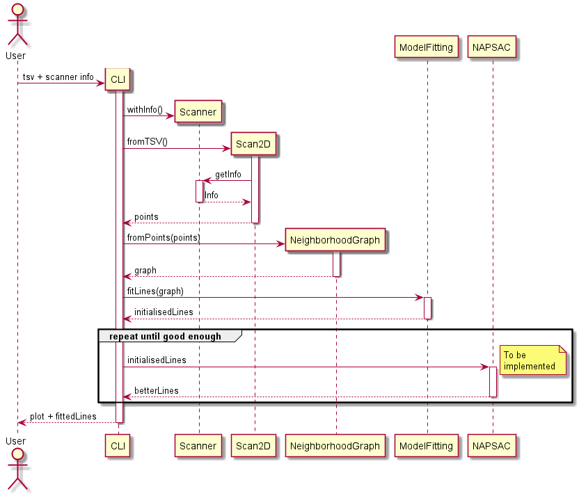

# floor-plan-generator
Backend for a service that turns input of a 2d lidar scan into a floorplan.

View our [docs](docs/index.md)!

# For Professor Edlich:

## 1. UML

1. Component diagram of the target architecture for the whole application (simplified, to explain my brother what's supposed to happen)

2. Overview over this module

3. What the target sequence should look like of this module

## 2. Metrics (see badges at top)

- **Codecov**
       : wouldn't recommend, wouldn't even explain what its complexity score means
- **Codacy**
    : would recommend, nice set of features even for private repositories

## 3. Clean Code Development

10 points checklist:
1. **descriptive / unambiguous names**: be it variables or methods, if you can't tell what it does by its name you should choose a different name (this also means it should tell you WHAT it does, not how, that's what documentation is for)
2. **short methods**: methods should be short and concise, my personal goal is at most 10 lines. Longer methods tend to violate the next two rules.
3. **methods should do exactly one thing / side effect free functions**: if you wouldn't expect the behavior from the name of the method it shouldn't be doing it. Logging might be a necessary evil.
4. **a method should keep the same level of abstraction**: don't mix different levels of abstraction within a method. If one part of it distributes low level computations to other methods, the other part should as well.
5. **short classes**: classes should be short and concise and do their job, and their job only. Nobody likes monoliths.
6. **opacity**: code should speak for itself. To cite my co-worker: "If I have to think for more than a minute what a line does, you should change the line." Don't be afraid to add more lines. Reading 10 lines in 3 seconds per line is still faster than taking a minute to figure out that fancy technique you found at stackoverflow.
7. **comments are usually bad**: !not to confuse with documentation! If you need a comment, you probably broke the opacity rule anyway. Comments age bad, it's easy to change the code without changing comments, leaving confusing and meaningless comments. Even worse: code hidden in comments is probably dead and should be removed. In the case it turns relevant again it can be found in your version control system.
8. **magic numbers**: will you remember why you divided by 5 here? Yes? What about in a month? No, don't add a comment, comments are bad. If unavoidable, turn it into a descriptive variable.
9. **explanatory variables**: speaking of descriptive variables, you can use them to explain different steps in your code.
10. **consistency**: if you do things 4 times one way, don't do it differently the 5th time.

5 points to show:
- short classes: all my classes are short. Without counting comments, none of them surpass 100 lines of code - except for [Scanner](src/main/kotlin/de/tsteffek/model/Scanner.kt). `Scanner` surpasses this for the sole reason of trying out ludicrous amounts of DSL writing styles.
- magic numbers: see `computeClosest()` in [NeighborhoodGraph](src/main/kotlin/de/tsteffek/model/NeighborhoodGraph.kt)
- explanatory variables: see `computeNextClosestRec()` in [NeighborhoodGraph](src/main/kotlin/de/tsteffek/model/NeighborhoodGraph.kt)
- consistency: most of my classes contain factory methods, all of them are called `fromX()` (compare UML). All my distance computations are within the [Geometry](src/main/kotlin/de/tsteffek/math/Geometry.kt) script, and all of them are overloaded versions of `distance()`, except for `distanceOriginLineToPoint(angle: Double, p: PolarPoint)`, which starts with "distance-", but wouldn't be declarative enough with just "distance".
- short methods: see [Geometry](src/main/kotlin/de/tsteffek/math/Geometry.kt), or anywhere, really.

## 4. Build Management
- Looked at Bazel, will DEFINITLY use it for my next Python project, since a good build management tool is one of the major points Python is lacking. (Pip and Anaconda lack the fluent dependency management build management tools of other languages have) However, it is definitely meant for larger projects, which this isn't.
- Went with **Gradle**, see [build.gradle.kts](build.gradle.kts) (hurray for the new Kotlin based DSL!). My build.gradle.kts does it all, manages several repositories and dependencies, configures my application, Kotlin, Jacoco and Dokka (JavaDoc for Kotlin), creates new tasks, adjusts existing ones, heck even calls an ant task at one point.

## 5. Unit Tests

There are a lot. See [tests](src/test/kotlin). Or just believe my Codacy badge up top. Used the basic **KotlinTest** framework together with **Mockk** (a mocking framework written in and for Kotlin).

## 6. Continuous Delivery

Tried the new **github actions**, see [github action workflows](.github/workflows). Am amazed.
My 2 workflows do:
- [Build&Test](.github/workflows/build_test.yml): builds and tests my project in 3 different os (2 are disabled right now, because it's not that critical right now). Then creates the Jacoco test report and uploads it to CodeCov and Codacy. Utilized a github action from the marketplace, because that's a great feature in github actions.
- [Release](.github/workflows/release.yml): builds the project, then runs [semantic release](https://github.com/semantic-release/semantic-release), which is my favorite new automated release cycle. Semantic release will create a pre-release on pushes to dev and a full release on pushes to master and manage version numbers on its own (as long as you write your commits like [this](.github/pull_request_template.md)). All just with [this many](.releaserc.json) lines. Wrote it using classical run-structure to test it out.

## 7. Use a good IDE

I used Intellij, which is not a good IDE, but sadly the best around. Main complaints are about quality of life changes, like drag&dropping editor views to split the view into multiple views. Which is a feature every Javascript editor is able to do, but since Intellij doesn't have any noteworthy competitors (for Kotlin especially) they don't care about making people happy. But it features the best Kotlin support, as well as Java to Kotlin translators.

Favorite hotkeys:
- Alt+Shift+S: Basically right-click without having to touch the mouse. From where, you can press e.g. 'r', then 'g' to change signature of a method.
- Alt+Ctrl+S: Open settings. I.e. to adjust auto-formatter.
- Ctrl+Shift+F: Auto-Formatter.
- Ctrl+Space: Suggests code completion. Absolutely necessary when coding.
- Ctrl+Shift+Space: Opens documentation. So you know what the function you're calling actually does.
- Alt+Enter: Show suggestions to fix whatever Intellij thinks is wrong. Squiggly line underneath your code? Alt+Enter.

## 8. DSL

I played around with some internal DSL, since Kotlin is such a good fit for it in my [Scanner class](src/main/kotlin/de/tsteffek/model/Scanner.kt). Scroll to the button for a main method comparing the approaches I tried.

## 9. Functional Programming

- only final data structures: not quite sure how to prove this, but I just checked, the keyword "var" only ever appears within functions. (The exception are builder classes in [Scanner](src/main/kotlin/de/tsteffek/model/Scanner.kt), again, all for the sake of DSLs)
- (mostly) side effect free functions: except for logging that is. Again, hard to prove, but I believe I did that.
- the use of higher order functions / functions as parameters and return values: not even counting [Scanner](src/main/kotlin/de/tsteffek/model/Scanner.kt), `filterAndCount()` in [Extensions.kt](src/main/kotlin/de/tsteffek/model/Extensions.kt) is a prime example for this. I even rewrote it to basically "supercharge" the function it gets with a counting feature. It works, but I personally think my original approach of extending the normal filter-method looks cleaner.
- use of closures / anonymous functions: there have been a huge variety of anonymous functions up to this point, but for closures you'll have to look at `asCyclicSequence()` or `asCyclicReversed()` in [Extensions.kt](src/main/kotlin/de/tsteffek/model/Extensions.kt).

## Optional 1: Logical Solver in the code

No clue.

## Optional 2: Write a little code fragment in Scala or Clojure!

I had no idea where to use Scala within this project, so I did my Kafka and Spark assignments in Scala (all the better since Apache actually uses Scala). If you need a reminder, they life here:
- [Kafka](https://github.com/tsteffek/Kafka-Scala-Example) (the bigger one, where I try some funny stuff like generating a lazy list with Scala's #:: operator ([here](https://github.com/tsteffek/Kafka-Scala-Example/blob/master/src/main/scala/model/PeriodicProducers.scala)))
- [Spark](https://github.com/tsteffek/Spark-Scala-Example)

## Optional 3: AOP

I.e. in [Extensions.kt](src/main/kotlin/de/tsteffek/model/Extensions.kt), the `filterAndCount` methods could be replaced by AOP jointpoints. Or the logging part of the `calculatePoints()` method in [Scan2D.kt](src/main/kotlin/de/tsteffek/model/Scan2D.kt). Everywhere you log is usually a good jointpoint. 
